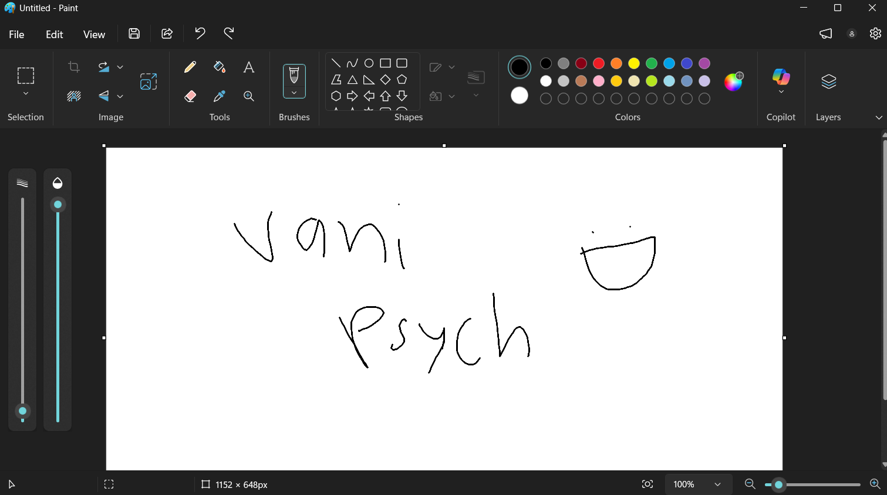

hey this is some like psych engine fork, some of the code is from my friends and other engines, credit is given inside the engine and here.
(as of right now there isnt any code from any other engine but i will let you know when there is)

#### NOTE!!!!
- vani psych does not have mac or linux versions in packages for right now, you need to compile the source code if you are a mac or linux user
- i dont know why but the base game songs just dont exist (ill put them in later)
- i suck at haxe and it took a week for me to figure out how to compile the game so cut me some slack

## features
* everything from psych 1.0.4
* botplay doesnt lag as much, great for showcasing!
* different hud

## planned features
* new options to play around with
* different chart editor theme
* mac and linux support in packages
* softcoded menu's (this probably wont happen im sorry)

## credits:
* EpikGuyVani: created the fork
* ShadowMario: created the base of Vani Psych, Psych Engine
* everyone on the fnf team and psych team

#### Psych Engine by ShadowMario, Friday Night Funkin' by ninjamuffin99
#### Vani Psych by EpikGuyVani
